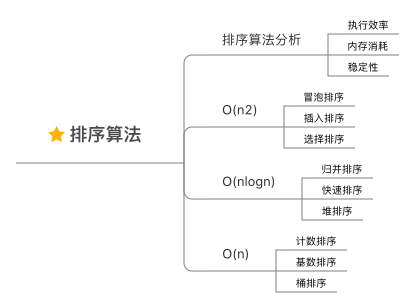
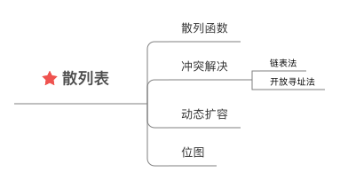
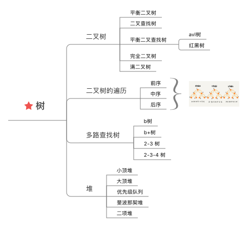

# 算法学习笔记

## 复杂度分析 🍊


### 1⃣️ 为什么需要复杂度分析🤔？
##### 事后统计法
将代码在实际的环境跑一遍，得到运行的时间和所需要的内存大小。

##### 事后统计法局限性
1. 测试结果非常依赖测试环境
2. 测试结果受测试数据规模影响很大

复杂度分析可以解决不用依赖具体测试数据、测试环境，就可以估算出算法的执行效率。

### 2⃣️ 大 O 复杂度表示法
所有代码的执行时间 T(n)，与每行代码的执行次数 n 成正比。
```
T(n) = O(f(n))
```
- T(n) 表示执行时间
- n 表示代码数据规模
- f(n) 表示每行代码的执行次数总和
- O 表示 T(n) 和 f(n) 成正比

`大O复杂度`表示代码执行时间与数据规模增长的变化趋势，也叫 `渐进时间复杂度`

### 3⃣️ 时间复杂度分析
1. 只关注循环执行次数最多的一段代码
2. 加法法则: 总复杂度等于量级最大的那段代码的复杂度
3. 乘法法则: 嵌套代码的复杂度等于嵌套内外代码复杂度的乘积

##### 时间复杂度分析四个概念
1. 最好时间复杂度: 代码在最理想情况下执行的时间复杂度
2. 最坏时间复杂度: 代码在最坏情况下执行的时间复杂度
3. 平均时间复杂度:
4. 均摊时间复杂度
   摊还分析法应用场景：
    1. 代码在绝大多数情况下是低级别复杂度，只有极少数情况是高级别复杂度
    2. 低级别和高级别复杂度出现具有时序规律。均摊结果一般都等于低级别复杂度。
   > **一般均摊时间复杂度等于最好情况时间复杂度**

##### 为什么引入四个复杂度概念？
同一段代码在不同输入的情况下，复杂度量级有可能是不一样的，引入这几个概念后，可以更加全面的表示代码执行效率。


##### 几种常见的时间复杂度实例
- **常量阶 O(1)**

  O(1)是常量阶时间复杂度表示方法，一般情况下，只要代码中不存在循环语句，递归语句，其代码复杂度就是O(1)

- **对数阶 O(log^n^)、 O(nlog^n^)**

  对数阶时间复杂度比较常见，如归并排序、快速排序的时间复杂度都是 O(nlog^n^)

- **线性阶 O(n)**
- **平方阶 O(n^2^)、立方阶 O(n^3^)、... k次方阶 O(n^k^)**
- **指数阶 O(2^n^)**
- **阶乘阶 O(n!)**


### 4⃣️ 空间复杂度分析
表示算法的存储空间与数据规模之间的增长关系。

---

## 线性表 🍉


### 1⃣️ 数组
数组是一种线性表数据结构。用一组连续的内存空间来存储具有相同类型的数据。随机访问复杂度为： O(1), 插入和删除的时间复杂度为： O(n)。

### 2⃣️ 链表
链表相对与数组来说，更适合用与频繁的插入和删除操作的场景，时间复杂度是 O(1)；但随机访问的时间复杂度是 O(n)。

**如何基于链表实现 LRU 缓存淘汰算法？**

维护一个有序单链表，越靠近链表尾的节点是越早之前访问的，当有新的数据被访问时，从头开始顺序遍历链表
1. 如果数据已经被缓存在链表了，则将该数据节点删除，并重新将其插入到链表头
2. 如果数据没有在链表中，分为两种情况
    1. 如果链表未满，则直接将该数据插入到链表头
    2. 如果链表已满，则将链表尾节点删除，然后将新的数据插入链表头

**如何轻松的写出正确的链表代码？**
- **技巧一： 理解指针或引用的含义**

  将某个变量赋值给指针，实际上就是将这个变量的内存地址赋值给指针，可以通过指针找到这个变量在内存中的位置。

- **技巧二：警惕指针丢失和内存泄露**

  尤其是插入节点的时候，防止出错。

- **技巧三： 利用哨兵简化实现难度**

  在节点p后插入一个新的节点：
  ```
  new_node->next = p->next
  p->next = new_node
  ```
  如果向一个空链表插入第一个节点，则上面的逻辑就会出错。需要特殊处理：
  ```
  if (head == null) {
      head = new_node
  }
  ```
  删除链表节点操作:
  ```
  p->next == p->next->next
  ```
  如果要删除的是链表最后一个节点，则上面的删除操作会出错，需要特殊处理：
  ```
  if (head->next == null) {
	  head = null
  }
  ```
  从前面的分析可知，针对链表的插入、删除操作，需要对插入第一个节点和删除最后一个节点做特殊处理，很容器出错。为了简化代码的实现，需要引入 *`哨兵`* 。
  引入 *`哨兵`* 之后，不管链表是否为空，head 指针一直指向 *`哨兵`* 节点，对于这种有 *`哨兵`* 节点的链表称之为 `带头链表`， 反之称之为 `不带头链表`。

- **技巧三： 重点处理边界条件处理**
    - 链表为空时，代码是否正常工作
    - 链表只包含一个节点时，代码是否正常工作
    - 链表只包含两个节点时，代码是否正常工作
    - 处理头节点和尾节点时，代码是否正常工作

### 3⃣️ 栈

##### 概念
操作符合 `先进后出` or `后进先出` 的线性表结构

栈可以用数组实现，也可以用链表实现。用数组实现的栈称之为 `顺序栈`，用链表实现的栈的称之为 `链式栈`。

如下 `顺序栈` 的实现实例 (基于go实现)：
```go
// 基于数组实现的顺序栈
type Stack interface {
  Push(string) bool
  Pop() string
}

type OrderStack struct {
  items [10]string
  count int
}

// 入栈
func (os *OrderStack) Push(item string) bool {
  if os.count == len(os.items) {
    return false
  }
  os.items[os.count] = item 
  os.count++
  return true
}

// 出栈
func (os *OrderStack) Pop() string {
  if os.count == 0 {
    return ""
  }
  item := os.items[os.count-1]
  os.count--
  return item
}
```

##### 栈的应用

- 函数调用栈

- 表达式求值
  

    - [代码实现](doc/expression_eval/expression_eval.go)

- 括号匹配
  依次扫描，将左括号放入栈中，遇到右括号则从栈顶取出一个左括号，如果匹配则继续扫描，如果扫描中不能匹配或者栈中有剩余数据，则说明为非法格式。
    - [代码实现](doc/parenthesis_match/parenthesis_match.go)


### 4⃣️ 队列

---

## 排序算法 🍌



**冒泡排序**


参考代码实现：
```go
func BubbleSort(datas []int) []int {
    for i := 0; i < len(datas)-1; i++ {
        for j := 0; j < len(datas)-1-i; j++ {
            if datas[j] > datas[j+1] {
                tmp := datas[j]
                datas[j] = datas[j+1]
                datas[j+1] = tmp
            }
        }
    }
    return datas
}
```

**插入排序**

```go
func InsertSort(datas []int) []int {
    for i := 1; i < len(datas); i++ {
        if datas[i] >= datas[i-1] {
            continue
        }
        for j := 0; j < i; j++ {
            if datas[i] < datas[j] {
                tmp := datas[i]
                k := i
                for {
                    if k == j {
                        break
                    }
                    datas[k] = datas[k-1]
                    k = k - 1
                }
                datas[j] = tmp
                break
            }
        }
    }
    return datas
}

```

**选择排序**

```go
func SelectSort(datas []int) []int {
    for i := 0; i < len(datas)-1; i++ {
        minIndex := i
        for j := i + 1; j < len(datas); j++ {
            if datas[minIndex] > datas[j] {
                minIndex = j
            }
        }
        tmp := datas[i]
        datas[i] = datas[minIndex]
        datas[minIndex] = tmp
    }
    return datas
}
```

**归并排序**

```go
func MergeSort(datas []int) []int {
	if len(datas) == 1 {
		return datas
	}
	left := MergeSort(datas[0 : len(datas)/2])
	right := MergeSort(datas[len(datas)/2 : len(datas)])

	return Merge(left, right)
}

func Merge(left, right []int) []int {
	leftLen := len(left)
	rightLen := len(right)
	sortDatas := make([]int, 0, leftLen+rightLen)

	i := 0
	j := 0

	for {
		if i == leftLen && j == rightLen {
			break
		}
		if i == leftLen {
			sortDatas = append(sortDatas, right[j:rightLen]...)
			break
		}
		if j == rightLen {
			sortDatas = append(sortDatas, left[i:leftLen]...)
			break
		}

		if left[i] < right[j] {
			sortDatas = append(sortDatas, left[i])
			i++
		} else {
			sortDatas = append(sortDatas, right[j])
			j++
		}
	}
	return sortDatas
}
```

**快速排序**

```go
func QuickSort(datas []int) []int {
    QuickSort_C(datas, 0, len(datas)-1)
    return datas
}

func QuickSort_C(datas []int, p, r int) {
    if p >= r {
        return
    }
    pivot := datas[r]
    i := p
    for j := p; j < r; j++ {
        if datas[j] < pivot {
            tmp := datas[j]
            datas[j] = datas[i]
            datas[i] = tmp
            i++
        }
    }
    tmp := datas[i]
    datas[i] = datas[r]
    datas[r] = tmp

    QuickSort_C(datas, 0, i-1)
    QuickSort_C(datas, i+1, r)
}
```

---

## 散列表 🍍




---
## 树 🌲




